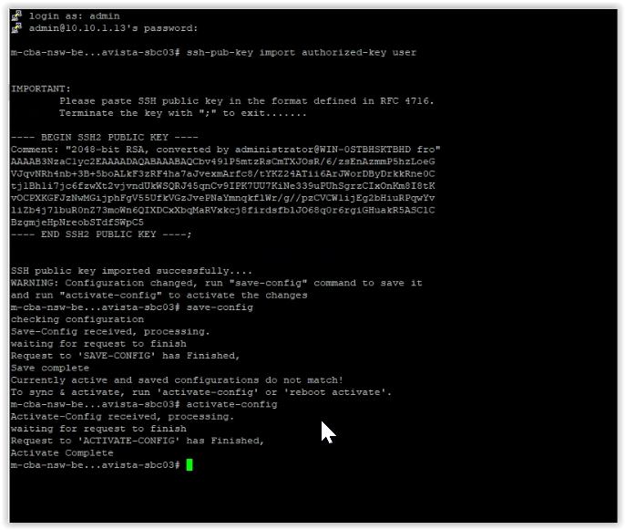

# Procedure to Install and Configure Backup and Reporting Scripts

## Setup Windows Server

-   Setup Windows Server 2019 as mentioned under section [VMware
    Design](#_VMware_Design) with below specs,

| CPU | RAM | Storage                                                                                                                        |
|-----|-----|--------------------------------------------------------------------------------------------------------------------------------|
| 4   | 16  | \~ 500G (Partitions as below) WINDOWS – 200G, HDR (K)-100G, BACKUP (L)-100G MAINTAINENCE (M)-100G Network: 1 network interface |

-   Create below folders in the HDR partition. The usage is as follows,

-   HDR – This folder will be used to store raw HDR files generated by the SBCs

-   REPORTS- This folder will be used to store generated monthly reports

    

-   Create below folders in the BACKUP partition. The usage is as follows,

-   ARCHIVE – This folder will store the SBC backups

-   LOGS – Archive logs, showing the success or failure of each backup run

    

## Install OpenSSH Server

On the windows 2019 server, navigate to settings-\>Apps-\>Apps & features and
select Manage optional features

Click Add feature and select OpenSSH Server. Click install

Validate OpenSSH server was successfully installed

## Configure OpenSSH Server

-   OpenSSH executables are located in the directory:
    c:\\windows\\system32\\OpenSSH\\ ;

-   The sshd_config configuration file is located in the directory:
    C:\\ProgramData\\ssh (this directory is created at the first start of the
    sshd service);

-   Log file: c:\\windows\\system32\\OpenSSH\\logs\\sshd.log ;

-   The authorized_keys file and keys are stored in a directory:
    %USERPROFILE%\\.ssh\\ .

-   Enable autostart for the SSHD service and start it using the following
    PowerShell service management commands.

    Set-Service -Name sshd -StartupType Automatic

    Start-Service sshd

-   Restart Computer

-   Validate sshd service has started automatically by issuing the below
    powershell command.

>   Get-Service sshd \| select -property name,starttype,status

-   Issue command netstat-na and validate the server is listening on port 22.

-   Use the PowerShell to open TCP port 22 in the Windows Firewall for incoming
    SSH traffic:

    New-NetFirewallRule -Protocol TCP -LocalPort 22 -Direction Inbound -Action
    Allow -DisplayName SSH

-   Set the default path for the sftp server by following the below steps,

Open the SSHD configuration file (C:\\ProgramData\\SSH\\sshd_config) in any text
editor. Find and check the Subsystem sftp directive.

Replace with,

>   Subsystem sftp sftp-server.exe -d K:\\

Where the root of the path to the location where HDR files will be stored is
given after the option –d (e.g. K:\\)

Restart the sshd service

-   Create a new user (nncentral) for SFTP access by navigating to
    settings-\>accounts-\>other users.

## Install Python

-   Download the latest stable python 3 executable (64-bit) from
    <https://www.python.org/downloads/>

-   

>   

>   Install below python modules (and their dependent modules) using pip. These
>   are required by the scripts.

-   pandas

-   pysftp

    Note: A active internet connection is required. If no such connection is
    present offline installation is required.

    pip install pandas

    

    pip install pysftp

    

## Configure SBC

Convert the sftp public key into a pem format by navigating to
C:\\ProgramData\\ssh and issuing the OpenSSH command ssh-keygen.

ssh-keygen -e -f .\\ssh_host_rsa_key.pub

Import the sftp server public key into the SBC as a known-host

ssh-pub-key import known-host \<Server-Name\>

Save and Activate config

Import the sftp server public key into the SBC as an authorized-key for the user
‘user’

ssh-pub-key import authorised-key user

Save and Activate config

## Install & Configure Python Scripts

Create and navigate to the scripts folder (e.g. C:\\Program Files\\Nora) of
choice and extract scripts into the folder. If not present, create sub-folder
‘logs’ as well.

-   backup.py - Script for backing up SBC configs

-   reports.py – Generates reports from SBC HDR data.

-   common.py – Contains functions common and used by other scripts.

-   config.py – Contains configuration parameters which can be amended by user.

-   /logs – Log directory, contains run-time logs for backup.py and reports.py
    scripts

The file config.py contains the configuration parameters used by scripts
backup.py and reports.py. The parameters contained and listed below should be
amended as required. Open the file config.py in a text editor (e.g. notepad.exe)

Below tales describes each parameter in config.py in detail.

**\# settings used by backup.py**

| BACKUP_DEVICE_LIST   | Is a dictionary in the format of [“Device 1 Name”: IP 1, “Device 2 Name”: IP 2] for each device that’s requires to be backed up. e.g. BACKUP_DEVICE_LIST={"m-cba-nsw-bellavista-sbc01":"10.38.240.39","m-cba-nsw-bellavista-sbc02":"10.38.240.40","m-cba-nsw-bellavista-sbc03":"10.38.240.44","m-cba-nsw-bellavista-sbc04":"10.38.240.51"] |
|----------------------|--------------------------------------------------------------------------------------------------------------------------------------------------------------------------------------------------------------------------------------------------------------------------------------------------------------------------------------------|
| SFTP_USER_NAME       | The username configured on the device. This user account will be used to sftp the backup out of the device. e.g. SFTP_USER_NAME= 'user'                                                                                                                                                                                                    |
| BKUP_LOG\_FILE_PATH  | The file name and path where log files will be created by the backup.py script. This log contains execution and exception information useful for troubleshooting purposes. e.g. BKUP_LOG_FILE_PATH="logs\\\\backup.log"                                                                                                                    |
| BKUP_LOG_FILE_SIZE   | Size of each backup.log file in Kilobytes(KB) e.g. for a file size of 1MB BKUP_LOG_FILE_SIZE=1024\*1024                                                                                                                                                                                                                                    |
| BKUP_LOG_FILE_MAX    | The maximum number of log files to keep before being over written (i.e. rotated). e.g. BKUP_LOG_FILE_MAX = 100                                                                                                                                                                                                                             |
| ARCH_LOG_FILE_PATH   | The file name and path where archive log files will be created. Archive log keeps a log of successful and failed backups and is for purposes of auditing the backup history. e.g. ARCH_LOG_FILE_PATH="L:\\LOGS\\\\archive.log"                                                                                                             |
| ARCH_LOG_FILE_SIZE   | Size of each archive.log file in Kilobytes(KB) e.g. for a file size of 1MB ARCH_LOG_FILE_SIZE=1024\*1024                                                                                                                                                                                                                                   |
| ARCH_LOG_FILE_MAX    | The maximum number of log files to keep before being over written (i.e. rotated). e.g. ARCH_LOG_FILE_MAX=100                                                                                                                                                                                                                               |
| PRIVATE_KEY_PATH     | Specifies the file name and path where the private key used by the OpenSSH server is stored. e.g. PRIVATE_KEY_PATH="C:\\ProgramData\\ssh\\ssh_host_rsa_key"                                                                                                                                                                                |
| REMOTE_FILE_PATH     | Specifies the file name and path where the backup file is available on the device. e.g. REMOTE_FILE_PATH='/code/gzConfig/dataDoc.gz'                                                                                                                                                                                                       |
| LOCAL_FILE_PATH      | Specifies the directory path where the backup files will be stored. e.g. LOCAL_FILE_PATH='L:\\ARCHIVE\\\\'                                                                                                                                                                                                                                 |
| DAYS_TO_KEEP_BACKUPS | Number of days to keep the backups before being purged. e.g. DAYS_TO_KEEP_BACKUPS=180                                                                                                                                                                                                                                                      |
| LOG_TO_CONSOLE       | If set to ‘True’ will print the log file output to console e.g. LOG_TO_CONSOLE=True                                                                                                                                                                                                                                                        |

**\# settings used by reports.py**

| REPORT_DEVICE_LIST         | Is a dictionary in the format of [‘Device 1 Name’, ‘Device 2 Name’, ‘Device 3 Name’] for each device / device HA pair that a report needs to generated for. The entry should match exactly as the folder name for each device in the HDR folder created under section [Setup Windows Server](#_Setup_Windows_Server) e.g. REPORT_DEVICE_LIST=['m-cba-nsw-bellavista-sbc01_m-cba-nsw-bellavista-sbc02','m-cba-nsw-bellavista-sbc03','m-cba-nsw-bellavista-sbc04','m-cba-nsw-burwood-sbc01_m-cba-nsw-burwood-sbc02','m-cba-nsw-burwood-sbc03','m-cba-nsw-burwood-sbc04'] |
|----------------------------|------------------------------------------------------------------------------------------------------------------------------------------------------------------------------------------------------------------------------------------------------------------------------------------------------------------------------------------------------------------------------------------------------------------------------------------------------------------------------------------------------------------------------------------------------------------------|
| REPORT_LOG_FILE_PATH       | The file name and path where log files will be created by the reports.py script. This log contains execution and exception information useful for troubleshooting purposes. e.g. REPORT_LOG_FILE_PATH="logs/reports.log"                                                                                                                                                                                                                                                                                                                                               |
| REPORT_LOG_SIZE=1024\*1024 | Size of each report log file in Kilobytes(KB) e.g. for a file size of 1MB REPORT_LOG_SIZE=1024\*1024                                                                                                                                                                                                                                                                                                                                                                                                                                                                   |
| REPORT_LOG_FILES           | The maximum number of log files to keep before being over written (i.e. rotated). e.g. REPORT_LOG_FILES=100                                                                                                                                                                                                                                                                                                                                                                                                                                                            |
| REPORT_LOCAL_FILE_PATH'    | Specifies the directory path where the generated report files will be stored. e.g. REPORT_LOCAL_FILE_PATH='K:\\REPORTS\\\\'                                                                                                                                                                                                                                                                                                                                                                                                                                            |
| HDR_LOCAL_PATH             | Specifies the directory path where the HDR files will be stored. e.g. HDR_LOCAL_PATH='K:\\HDR\\\\'                                                                                                                                                                                                                                                                                                                                                                                                                                                                     |
| DAYS_TO_KEEP_REPORTS       | Number of days to keep the generated reports before being purged. e.g. DAYS_TO_KEEP_REPORTS=365                                                                                                                                                                                                                                                                                                                                                                                                                                                                        |
| DAYS_TO_KEEP_HDR           | Number of days to keep the generated reports before being purged. e.g. DAYS_TO_KEEP_HDR=180                                                                                                                                                                                                                                                                                                                                                                                                                                                                            |
| LOG_TO_CONSOLE             | If set to ‘True’ will print the log file output to console e.g. LOG_TO_CONSOLE=True                                                                                                                                                                                                                                                                                                                                                                                                                                                                                    |

## Test Scripts

Open a PowerShell window and navigate to the scripts folder and run the
backup.py script without any optional parameters

python backup.py

Perform the same for the reports script

python reports.py

Ensure,

-   No errors are seen on the output

-   The file backup.log is created in the logs directory

## Configure Windows Task Scheduler

Configure a task to schedule the backup.py script

-   Task scheduler -\> Create Task

On the General Tab,

-   Specify a Name for the script (e.g. backup)

-   Select a user account with sufficient privileges to run the task.

-   Select ‘Run whether user is logged on or not’ and check ‘Do not store
    password’

On the Triggers Tab, create a new trigger

-   Set Begin the task option to ‘On a schedule’

-   Select option ‘Daily’ and ‘recur every 1 days ‘ (The script will be executed
    daily at the time specified.)

-   Check ‘Enabled’

-   Click OK to get back to the main properties window

On the Actions Tab, create a new Action

-   Set Action as ‘Start a program’

-   Under Program/script provide the path or browse to the python executable
    e.g. "C:\\Program Files\\Python38\\python.exe"

-   Populate the ‘Add arguments’ section to point to the python script with any
    additional parameters required. e.g. backup.py -- cleanup

-   Populate the ‘Start in’ section with the path to the python script referred
    earlier. e.g. C:\\Program Files\\Nora

-   Click ok to get back to the main properties window.

Configure another task to schedule the reports.py script

-   Task scheduler -\> Create Task

On the General Tab,

-   Specify a Name for the script (e.g. reports)

-   Select a user account with sufficient privileges to run the task.

-   Select ‘Run whether user is logged on or not’ and check ‘Do not store
    password’

On the Triggers Tab, create a new trigger

-   Set Begin the task option to ‘On a schedule’

-   Select option ‘Monthly’ and ‘Days‘ (The script will be executed every month
    on the Day(s) and at the time specified.)

-   Check ‘Enabled’

-   Click OK to get back to the main properties window

On the Actions Tab, create a new Action

-   Set Action as ‘Start a program’

-   Under Program/script provide the path or browse to the python executable
    e.g. "C:\\Program Files\\Python38\\python.exe"

-   Populate the ‘Add arguments’ section to point to the python script with any
    additional parameters required. e.g. reports.py -- cleanup

-   Populate the ‘Start in’ section with the path to the python script referred
    earlier. e.g. C:\\Program Files\\Nora

-   Click ok to get back to the main properties window.

Validate tasks can be executed successfully by navigating to the Task Scheduler
Library and ‘Run’ each task.

